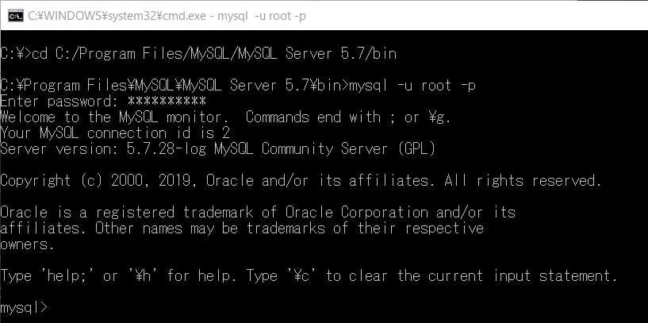
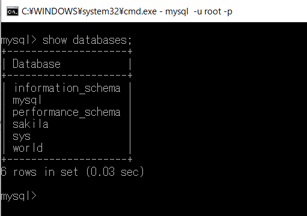
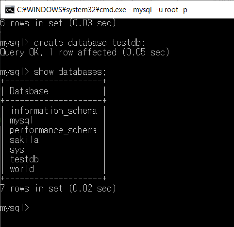
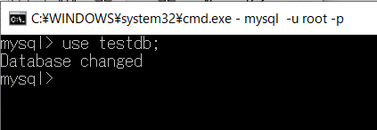
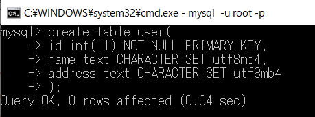
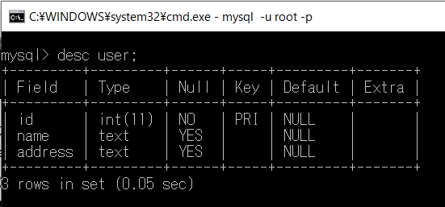
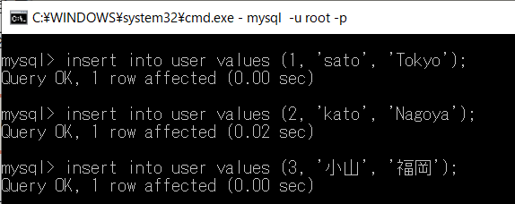
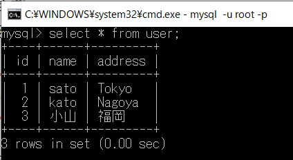
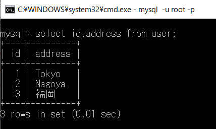

## MySQL使用手順
1. MySQLにログイン
   >`cd C:/Program Files/MySQL/MySQL Server 5.7/bin`
   >
   >`mysql -u root -p` 
   >
   >**(※設定したパスワードを入力)**

    

1. DBの状況確認
   >`show databases;`

    

1. DB作成
   >`create database DB名;`
   >
   >※Query OKが出力され、`show databases;`にて作成したDB名が表示されればOK

    

1. 使用するDBを選択
   >`use 作成したDB名;`

    

1. テーブル作成
   >`create table 作成したいテーブル名(`
   >
   >挿入したいカラム名 型
   >
   >);

    

1. テーブル/カラムの確認
   >`desc （テーブル名）;`
   >
   >※Query OK.が出力され、作成したテーブル名・カラム名が表示されればOK

    

1. データ追加
   >`insert into テーブル名　values (カラム１に入れたい値,カラム2に入れたい値...);`

    

1. データの取得
   >`select （取得したいカラム名1,カラム名2） from テーブル名;`

    

    